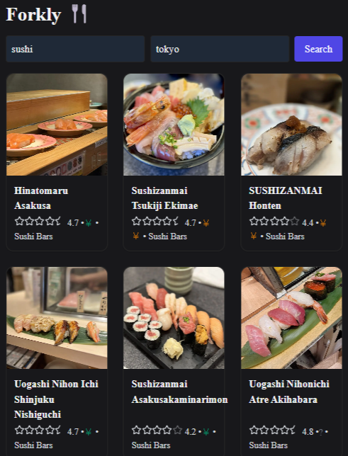

# Forkly
Discover and save your favorite local restaurants — powered by Yelp, built with Next.js, Firebase, and Tailwind.



## Features

- Search restaurants by location, category, or price
- Save to your wishlist (with Firebase Auth)
- Live data from Yelp Fusion API
- Fast UI with Tailwind CSS and caching

## Tech stack
- Next.js 14
- Tailwind
- Firebase Auth
- Firestore
- Yelp Fusion

## Firestore Schema

## Firestore Collections (v0.1)
```
users/{uid}
displayName, email, createdAt

wishlists/{uid}/items/{bizId}
addedAt
snapshot (optional Yelp fields cache)

restaurants/{bizId} (optional central cache)
name, price, rating, category, lastFetched
```
## API Docs

Explore our current test endpoints using Postman:
[`api-docs/Forkly-Spike.postman_collection.json`](./api-docs/Forkly-Spike.postman_collection.json)

## Local Development

```bash
git clone https://github.com/yourusername/forkly.git
cd forkly
npm install
# Add Yelp + Firebase keys to .env.local
npm run dev
```

Visit [http://localhost:3000](http://localhost:3000) to view the app.


## License
This project is licensed under the [MIT](https://mit-license.org) License - see the LICENSE file for details.